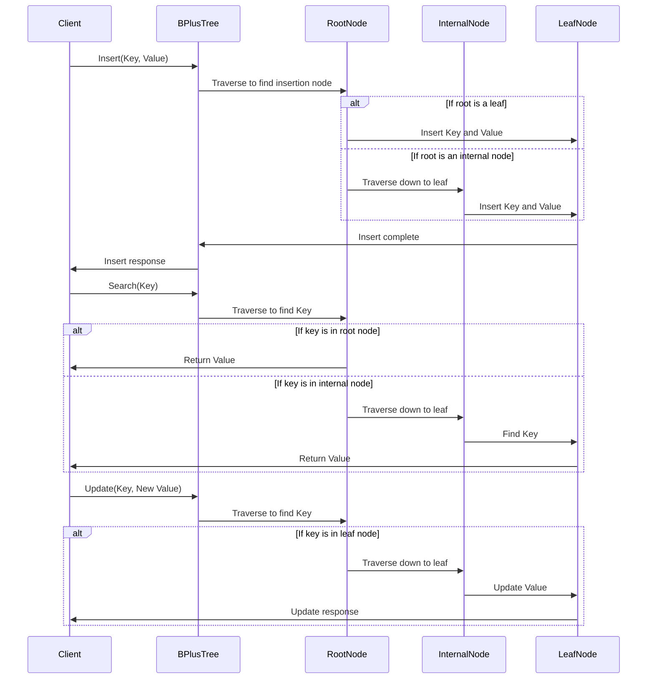

```bash
               +-------------+
               |     Root    |
               |  Keys:[5]   |
               +------|------+
                      |
             +--------+--------+
             |                 |
      +-------------+    +-------------+
      | Internal    |    | Internal    |
      | Keys:[2, 3] |    | Keys:[7, 8] |
      +-----|-------+    +------|------+
            |                   |
    +-------+--------+    +-----+-------+
    |                |    |             |
  +-------+   +-------+ +-------+  +-------+
  | Leaf |    | Leaf  | | Leaf  |  | Leaf  |
  | Keys: |   | Keys: | | Keys: |  | Keys: |
  | [1, 2]|   | [4, 5]| | [6, 7]|  | [8, 9]|
  +-------+   +-------+ +-------+  +-------+

```
## B+ 樹的運作流程

### 1. 插入

1. 插入鍵值對 (4, "Alice")
2. 插入鍵值對 (5, "Bob")
3. 插入鍵值對 (6, "Charlie")
4. 插入鍵值對 (7, "David")
5. 插入鍵值對 (8, "Eve")
6. 插入鍵值對 (9, "Frank")

當插入新鍵時，從根節點開始搜索合適的子節點進行插入。
如果葉節點滿了，會將該節點分裂為兩個葉節點，並將中間鍵上移到父節點。
如果分裂導致父節點滿了，則會遞歸地將父節點也進行分裂，直到根節點。如果根節點分裂，會創建新的根節點。

### 2. 搜尋
從根節點開始，根據鍵的大小找到合適的子節點並逐層向下查詢。
一旦到達葉節點，即可在該節點中查找並返回對應值。

###3. 刪除
刪除鍵時，從根節點查找到合適的葉節點，然後從葉節點刪除該鍵。
如果刪除導致節點鍵數不足，則會嘗試從相鄰的兄弟節點借用鍵，或合併該節點與其兄弟節點。

### 4. 更新
更新的流程與查詢相似。找到葉節點後，直接更新對應鍵的值。

---

## 時序圖


